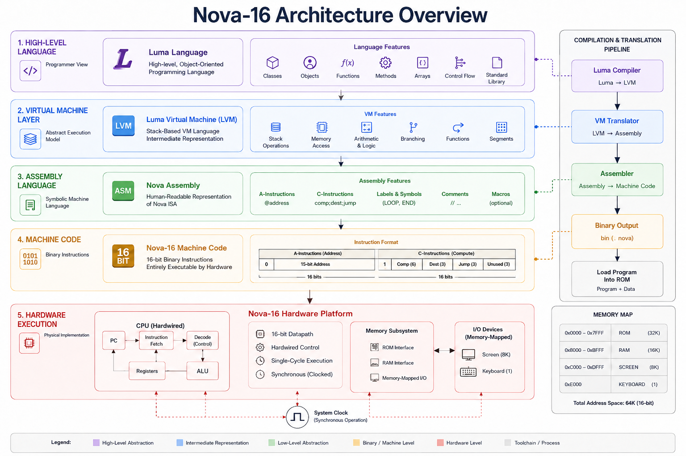

# Nova-16

> Nova-16 is a complete 16-bit computer architecture project with an end-to-end stack from high-level language to hardware execution.

Nova-16 combines a high-level compiler, virtual machine translator, assembler, machine-level CPU, memory-mapped I/O, and a minimal operating system. Every layer is implemented in this repository, from software translation to Verilog RTL, with the goal of preserving clarity and correctness in the architecture.

---

## 🎥 Demo and Diagram

- Architecture diagram: `docs/architecture.png`
- System design and language references: `docs/Nova-16_ A Complete 16-Bit Computer System.pdf`
- Luma language reference: `docs/The Luma Language Specification.pdf`

[](https://your-demo-video-link-here)

🔗 Full demo/video link: https://www.youtube.com/watch?v=kNfhy538wnk

---

## 🧠 System Overview

Nova-16 is built as a layered execution pipeline:

1. `Software/Compiler` compiles `.luma` source into stack-based `.vm` code.
2. `Software/VM Translator` converts `.vm` commands into Nova-16 assembly.
3. `Software/NovaAssembler` assembles Nova-16 assembly into 16-bit binary machine code.
4. `Hardware/verilog_sources` implements the Nova-16 CPU, instruction fetch, ALU, registers, and memory interface.
5. `Hardware/Mem_files` and `Hardware/tb` provide sample program memory content and testbench support.

This pipeline is deterministic and fully traceable: every high-level construct is translated through VM semantics into a concrete machine-level instruction stream.

---

## 🏗 Architecture and Execution Model

Nova-16 is a 16-bit, single-cycle, synchronous architecture with a separate program memory and data/memory-mapped I/O.

### Instruction model

- 16-bit machine word.
- Two instruction classes:
  - **A-instructions**: load a 15-bit address or constant into the A register.
  - **C-instructions**: perform ALU operations, write results to registers/memory, and optionally jump.

### CPU datapath

The core CPU is implemented in `Hardware/verilog_sources/CPU.v` and includes:

- **A register** (`ARegister.v`): holds addresses and immediate operands.
- **D register** (`DRegister.v`): stores computation operands.
- **ALU** (`ALU.v`): computes bitwise and, addition, and supports zero/negate controls.
- **Memory interface** (`Memory.v`): selects RAM, screen, or keyboard based on address bits.
- **Program counter** (`PC.v`): increments or loads from A depending on jump conditions.

The CPU decodes the top bit of the instruction word to distinguish A and C instructions. For C-instructions, control bits select ALU behavior, destination registers, and jump conditions.

### Memory and I/O

The memory system is encoded in `Hardware/verilog_sources/Memory.v`.

- `address[14] = 0` selects the 16K RAM block.
- `address[14] = 1` and `address[13] = 0` selects the screen device.
- `address[14] = 1` and `address[13] = 1` selects the keyboard device.

`ROM32K.v` contains a 32K-word instruction ROM initialized in Verilog, so the instruction image is embedded directly in the hardware model.

`Computer.v` ties the CPU, ROM, and memory together into a complete system. The CPU fetches instructions from ROM, executes them, and uses the shared memory module for data and I/O.

### ALU behavior

The ALU in `Hardware/verilog_sources/ALU.v` implements the classic 16-bit function block with control inputs:

- `zx`, `nx`: zero / negate the X input
- `zy`, `ny`: zero / negate the Y input
- `f`: select add or AND
- `no`: negate the output

It also produces `zr` and `ng` flags for zero and negative results, which the CPU uses to evaluate conditional jumps.

---

## 💻 Software Stack

### 1️⃣ Luma Language and Compiler: `Software/Compiler`

The high-level language is a small object-oriented language called Luma. It supports:

- `class`, `constructor`, `function`, and `method`
- field and static variable declarations
- local variables with `var`
- arrays and array indexing
- `if`, `while`, `do`, and `return`
- string literals and keyword constants (`true`, `false`, `null`, `this`)

#### Compiler architecture

The compiler is driven by `Software/Compiler/LumaCompiler.java`. It uses a classic recursive descent parser in `Software/Compiler/parser/CompilationEngine.java` and emits VM instructions through `Software/Compiler/vm/VMWriter.java`.

Flow:

```
Luma source (.luma)
      ↓ tokenizer
Token stream
      ↓ recursive descent parser
AST-like control flow / symbol resolution
      ↓ VMWriter
stack-based VM code (.vm)
```

#### Key compiler components

- **Tokenizer** (`LumaTokenizer.java`)
  - strips comments (`//`, `/* ... */`)
  - recognizes identifiers, keywords, symbols, integers, and string constants
  - supports lookahead via save/restore state

- **Symbol table** (`SymbolTable.java`)
  - maintains separate class-level and subroutine-level scopes
  - records symbols by kind: `STATIC`, `FIELD`, `ARG`, `VAR`
  - assigns incremental indexes per kind

- **Compilation engine** (`CompilationEngine.java`)
  - parses top-level `class` structure
  - compiles variable declarations, subroutine declarations, and bodies
  - emits VM code for statements and expressions
  - handles methods, constructors, and function calls explicitly

#### Parsing and code generation patterns

The compiler uses the recursive descent pattern:

- `compileClass()` parses the class header, fields, and subroutines
- `compileSubroutineDec()` parses each method/constructor/function
- `compileStatements()` dispatches based on statement keyword
- `compileExpression()` implements an expression grammar with operator precedence implicit through parsing order
- `compileTerm()` handles constants, variables, array access, subroutine calls, parentheses, and unary operators

This design keeps parsing and code emission tightly coupled, but each compile function remains responsible for one grammar element.

#### Example code paths

- `let x = expr;` → compile expression, then `pop` into the variable segment
- `if (expr) { ... } else { ... }` → compile expression, then generate labels for true/false/end blocks
- `do obj.method(args);` → compile call, then discard return value with `pop temp 0`
- `return expr;` → compile expression and emit `return`; `return;` emits `push constant 0` first

### 2️⃣ VM Translator: `Software/VM Translator`

This translator maps stack VM commands to Nova-16 assembly.

Flow:

```
VM file (.vm)
      ↓ parse each command
untyped VM operations
      ↓ CodeWriter
Nova-16 assembly (.asm)
```

#### Runtime model

The translator implements the standard stack-machine conventions:

- `SP` is the stack pointer
- `local`, `argument`, `this`, and `that` are base-pointer segments
- `temp`, `pointer`, and `static` are fixed or file-scoped segments
- `constant` pushes immediate values to the stack

#### Control flow and function support

It also implements the VM calling convention:

- bootstrap code sets `SP = 256`
- `Sys.init` is called at startup
- `call` pushes return address and saved segment pointers, repositions `ARG`, sets `LCL`, and jumps
- `return` restores the caller frame from `R13`/`R14` and returns control

The translator is responsible for label scoping inside functions, using `currentFunction` to disambiguate generated labels.

#### CodeWriter implementation

The translator generates assembly using helper routines for:

- binary stack arithmetic (`add`, `sub`, `and`, `or`)
- unary operations (`neg`, `not`)
- comparisons (`eq`, `gt`, `lt`) using temporary labels and conditional branches
- push/pop for all memory segments
- function prologue (`function`) initializing local variables
- call frame manipulation and return sequence

A few examples:

- `writeBinary("M=D+M")` implements stack binary arithmetic by popping two values and writing the result to `SP-1`
- `writeCompare("JEQ")` emits a comparison sequence with labeled true/false branches
- `writeCall()` pushes the caller context and transfers control to the callee

### 3️⃣ Assembler: `Software/NovaAssembler`

The assembler converts human-readable Nova assembly into 16-bit machine instructions.

Flow:

```
Assembly source (.asm)
      ↓ Parser
Symbol-resolved statements
      ↓ two-pass translation
Machine code (.nova)
```

#### Two-pass algorithm

1. **First pass** scans labels `(LABEL)` and records their ROM addresses in the symbol table.
2. **Second pass** encodes every A- and C-instruction, resolving symbols and allocating variables starting at address `16`.

#### Instruction encoding

- A-instruction: `0` + 15-bit value
- C-instruction: `111` + `comp` (7 bits) + `dest` (3 bits) + `jump` (3 bits)

`Code.java` contains the translation tables for `dest`, `comp`, and `jump`. It supports the full Nova-16 computation set with both `A` and `M` variants.

#### Symbol handling

The assembler initializes predefined symbols:

- `SP`, `LCL`, `ARG`, `THIS`, `THAT`
- `R0`–`R15`
- `SCREEN`, `KBD`

It also allocates new variables sequentially from address `16` when first encountered.

### 4️⃣ Operating System Layer: `Software/OS`

This repository includes an OS-like runtime written in Luma.

The OS layer provides:

- memory utilities and initialization
- screen and keyboard abstractions
- text and numeric output routines
- basic system services in `Sys.luma`

`Sys.init()` initializes the runtime services and invokes `Main.main()`. If the user program returns, `Sys.halt()` enters an infinite loop to stop execution cleanly.

---

## 🏗 Hardware Implementation Details

### Instruction format

Nova-16 machine instructions are 16 bits wide.

- **A-instruction**: `0 v v v v v v v v v v v v v v`
  - loads a 15-bit constant into the A register
- **C-instruction**: `1 1 1 a c c c c c c d d d j j j`
  - `a` selects whether the ALU uses the A register or the M input
  - `comp` selects ALU operation
  - `dest` controls writes to `A`, `D`, and/or memory
  - `jump` encodes conditional transfer of control

### CPU datapath and control

`Hardware/verilog_sources/CPU.v` implements the core datapath:

- `instruction[15] == 0` → A-instruction
- `instruction[15] == 1` → C-instruction

A instruction behavior:

- `ARegister` loads the immediate address from the instruction
- `addressM` and `pc` are derived from the A register when needed

C instruction behavior:

- ALU inputs:
  - `x = D register`
  - `y = A register` or `inM` depending on `instruction[12]`
- ALU control signals are taken from `instruction[11:6]`
- `loadA` and `loadD` are gated by the `dest` bits `instruction[5]` and `instruction[4]`
- `writeM` is asserted when `dest` includes `M` (`instruction[3]`)
- `outM` is the ALU result ready for memory writes

Jump evaluation:

- `zrOut` and `ngOut` come from the ALU
- `jumpNeg`, `jumpZero`, `jumpPos` are derived from the low 3 jump bits
- `doJump` combines jump conditions with `isCInstr`
- `PC` loads the value from `A` when `doJump` is true, otherwise increments

### ALU implementation

`Hardware/verilog_sources/ALU.v` uses control bits to transform operands:

- zero and negate each input independently
- choose addition or bitwise AND
- optionally negate the final result
- compute zero and negative status outputs

This matches the canonical 16-bit ALU design used by the Nova-16 control logic.

### Registers and sequencing

- `ARegister.v` and `DRegister.v` are 16-bit register banks implemented from `Bit.v` instances
- `PC.v` uses an internal register and can either increment or load the `A` register
- `Register.v` is a reusable 16-bit storage module built from 16 `Bit` cells

### Memory subsystem

`Hardware/verilog_sources/Memory.v` implements memory-mapped devices.

Memory map:

- `0x0000`–`0x7FFF` → RAM16K
- `0x8000`–`0xBFFF` → Screen
- `0xC000`–`0xDFFF` → Keyboard

Address decoding:

- `address[14] = 0` → RAM
- `address[14] = 1` and `address[13] = 0` → Screen
- `address[14] = 1` and `address[13] = 1` → Keyboard

The memory module routes reads and writes through `RAM16K`, `Screen`, and `Keyboard` by combining selection signals.

### System integration

`Hardware/verilog_sources/Computer.v` is the top-level system module.

It connects:

- `ROM32K` for instruction memory
- `CPU` for execution and memory control
- `Memory` for data memory and I/O

This module demonstrates the complete hardware closure for Nova-16.

---

## 📁 Repository Layout

```
github_repo/
├── Hardware/
│   ├── mem_files/          # Sample ROM contents
│   ├── tb/                 # Verilog testbench files
│   ├── verilog_sources/    # Core hardware implementation
│   │   ├── ALU.v
│   │   ├── CPU.v
│   │   ├── Computer.v
│   │   ├── Memory.v
│   │   ├── ROM32K.v
│   │   ├── PC.v
│   │   ├── Register.v
│   │   ├── top_comp.v
│   │   ├── ps2_interface.v
│   │   └── vga_engine.v
│   └── xdc/                # FPGA constraints
├── Software/
│   ├── Compiler/
│   │   ├── LumaCompiler.java
│   │   ├── parser/CompilationEngine.java
│   │   ├── tokenizer/LumaTokenizer.java
│   │   ├── symboltable/SymbolTable.java
│   │   └── vm/VMWriter.java
│   ├── NovaAssembler/
│   │   ├── NovaAssembler.java
│   │   ├── parser/Parser.java
│   │   └── code/Code.java
│   ├── "VM Translator"/
│   │   ├── VMTranslator.java
│   │   ├── parser/Parser.java
│   │   └── codewriter/CodeWriter.java
│   └── OS/                # Runtime library source files
├── docs/
│   ├── architecture.png
│   ├── "Nova-16_ A Complete 16-Bit Computer System.pdf"
│   └── "The Luma Language Specification.pdf"
└── README.md
```

---

## 🛠 Build and Run

### Compiler

```
cd Software/Compiler
javac *.java parser/*.java tokenizer/*.java symboltable/*.java vm/*.java
java LumaCompiler path/to/Program.luma
```

### VM Translator

```
cd "Software/VM Translator"
javac *.java parser/*.java codewriter/*.java utils/*.java
java VMTranslator path/to/Program.vm
```

### Assembler

```
cd Software/NovaAssembler
javac *.java parser/*.java code/*.java util/*.java
java NovaAssembler path/to/Program.asm
```

### Hardware Simulation

- `Hardware/verilog_sources/Computer.v` is the top-level system module.
- `Hardware/verilog_sources/CPU.v` is the Nova-16 CPU datapath.
- `Hardware/verilog_sources/Memory.v` provides RAM and memory-mapped display/keyboard access.

---

## � End-to-End Compilation Flow

This repository executes a complete translation chain from `.luma` source down to `.nova` machine code.

1. **Compile Luma source**
   - Input: `Software/Compiler/Main.luma` or another `.luma` file
   - Command: `java LumaCompiler path/to/Program.luma`
   - Output: `Program.vm`

2. **Translate VM to assembly**
   - Input: `Program.vm`
   - Command: `java VMTranslator path/to/Program.vm`
   - Output: `Program.asm`

3. **Assemble Nova-16 assembly**
   - Input: `Program.asm`
   - Command: `java NovaAssembler path/to/Program.asm`
   - Output: `Program.nova`

4. **Load into hardware simulation**
   - `Program.nova` is the machine code representation that can be loaded into the Nova-16 ROM or used by a Verilog testbench.
   - The hardware model in `Hardware/verilog_sources/Computer.v` and `Hardware/verilog_sources/CPU.v` executes the machine code against memory and I/O.

### Example file path sequence

```
Software/Compiler/Test.luma  →  Software/Compiler/Test.vm
Software/VM Translator/Test.vm  →  Software/VM Translator/Test.asm
Software/NovaAssembler/Test.asm  →  Software/NovaAssembler/Test.nova
```

### What each layer adds

- **Compiler**: converts structured, object-oriented code into stack-based VM operations.
- **VM Translator**: converts stack operations and function call semantics into Nova assembly statements.
- **Assembler**: converts symbolic assembly into fixed-width 16-bit machine instructions.
- **Hardware**: executes machine instructions, updates registers, and performs memory/I/O operations.

This workflow preserves the meaning of the original program at every stage while making each transformation explicit and testable.

---

## �🔍 Design Highlights

- **Full-stack implementation**: source language → VM → assembly → machine code → RTL hardware.
- **Modular translation**: each software layer has a clear responsibility and well-defined output format.
- **Memory-mapped I/O**: display and keyboard are integrated into the address space using high address bits.
- **Explicit hardware semantics**: the CPU is defined in Verilog with separate register files, ALU control, and jump logic.
- **Reusable runtime**: the OS layer supports standard services for user programs, including initialization, output, and basic utilities.

---

## 📌 Notes

- The architecture diagram is available at `docs/architecture.png`.
- The repository contains a complete machine code path without hidden external dependencies.
- The system is designed to be self-contained, with hardware behavior specified in Verilog and software translation implemented in Java and Luma.


---

## 🔮 Future Enhancements

- Pipelined CPU variant
- Interrupt support
- Expanded ISA
- Performance benchmarking
- Formal instruction verification

---

## 📚 Inspiration

Nova-16 draws conceptual inspiration from classical reduced instruction set architectures, stack-based virtual machines, and structured compiler design methodologies. The focus is on architectural clarity and full-stack computing implementation.

---

## 📄 License

Released for educational and research exploration.
